

	
Art to my engineering is like my yin to my yang. It keeps me in balance and provides a creative outlet for myself to destress and have fun! Primarily, I'm a dancer trained in ballet, jazz, lyrical, contemporary, and a little bit of tap and hip hop, but my favorite style is contemporary and lyrical. Additionally, I enjoy painting and trying out different things such as bullet journaling and string art. Below is a brief gallery of my pieces I've done :) 

<section id="dance">
	<h3>Dance</h3>
	

		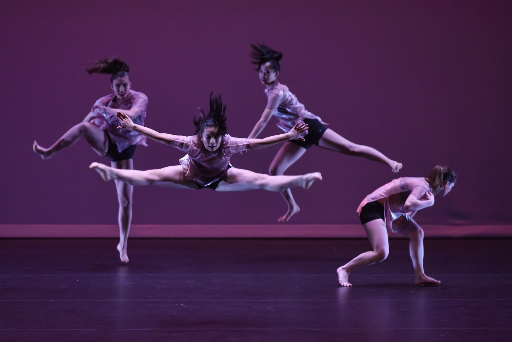
		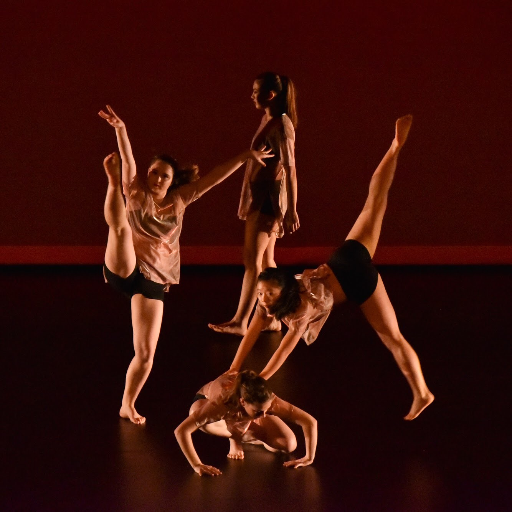
		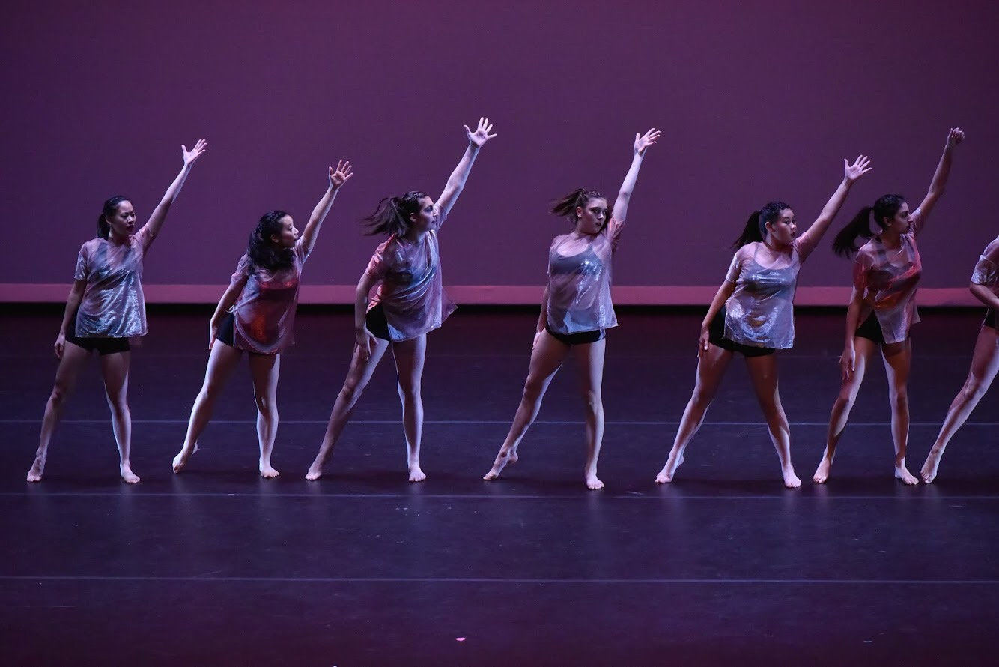
		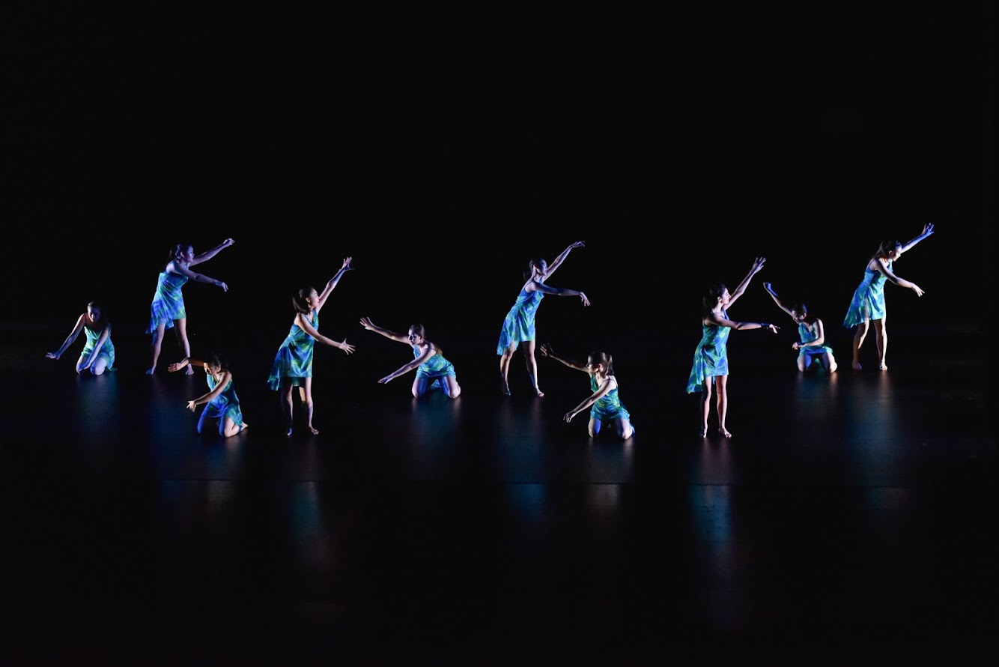
		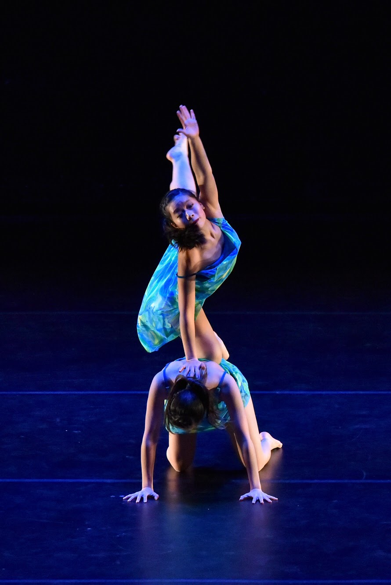
		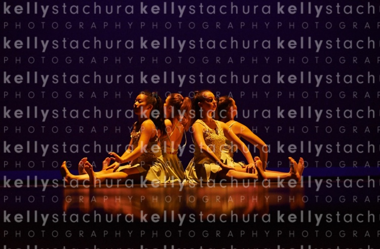
		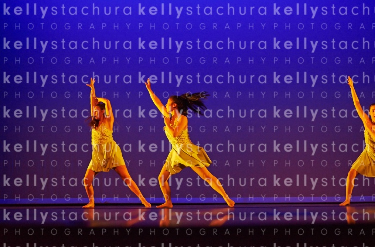
		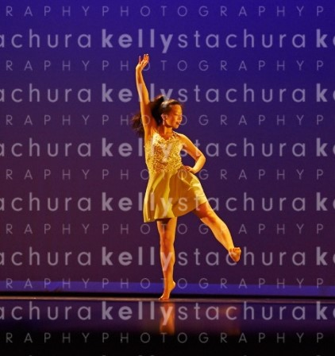
		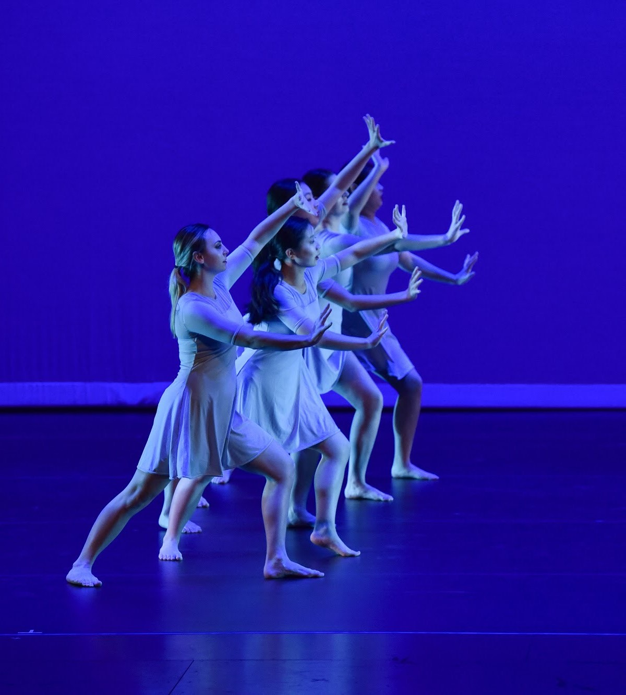
		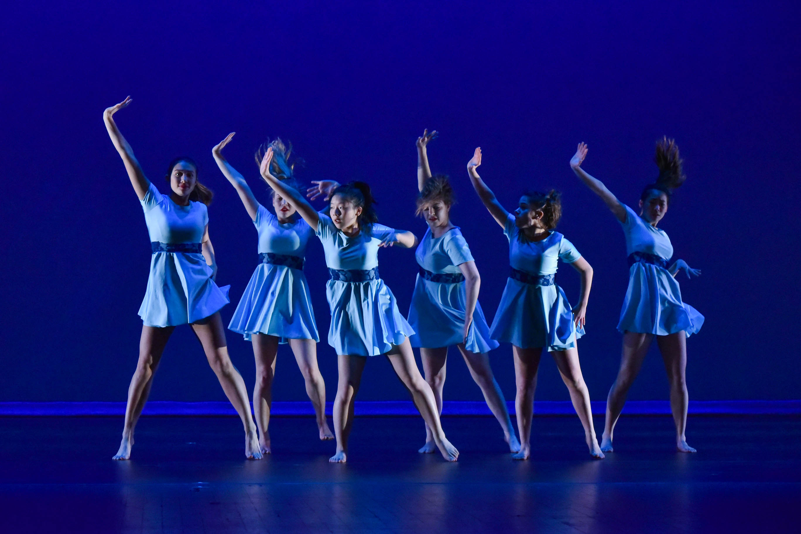
		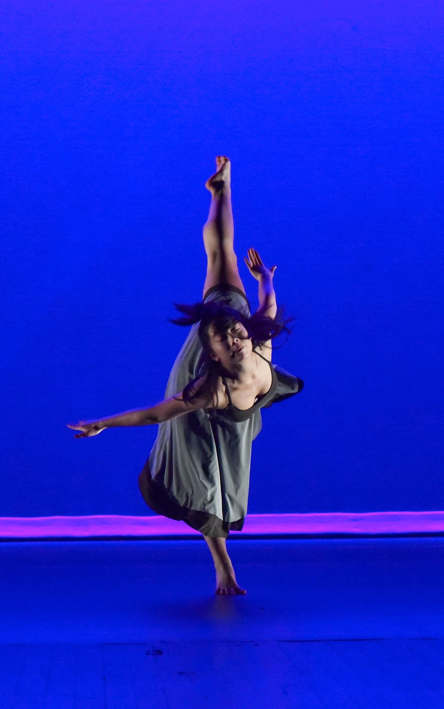
	

</section>
