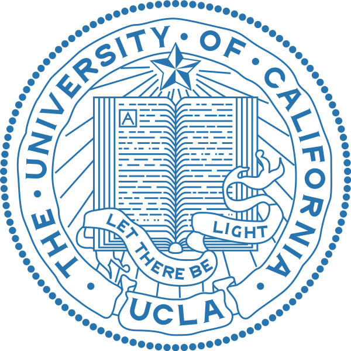

	

		

			
		

		

			
		

	

	

	<h4 style="margin-bottom: 3px">University of California, Los Angeles</h4>
	
Los Angeles, California

	
2018-2022

	
<b>Degree:</b> Bachelor's of Science in Computer Science

	
<b>Academic Achievements:</b>

		<ul>
			<li>SWE LA Scholarship Recipient (2020)</li>
			<li>Tau Beta Pi Engineering Society Member since Spring 2019</li>
			<li> UCLA Women in Engineering Scholarship (2019)</li>
			<li>UCLA SWE Scholarship (2019)</li>
		</ul>
	
<b>On campus involvements:</b>

		<ul>
			<li>SuperMileage Vehicle in Bruin Racing (2018-Present)</li>
			<li>Society of Women Engineers (2018-Present)</li>
			<li>Creative Labs (2019-Present)</li>
			<li>Building Engineers and Mentors (2018-Present)</li>
			<li>Intramurals (frisbee and volleyball)</li>
		</ul>
	
<b>Favorite thing about UCLA:</b> The school's concern for students' physical and mental health in addition to academic excellence! And B-Plate!

	<h4 style="margin-bottom: 3px">Adlai E. Stevenson High School</h4>
	
Lincolnshire, Illinois

	
2014-2018

	
<b>Academic Achievements:</b>

		<ul>
			<li>Illinois Principal's Association Student Recognition (2018)</li>
			<li>Illinois Science Teacher's Association Excellence in Science Award (2018)</li>
			<li>Gold Honor Roll (All A's) for 8 semesters</li>
		</ul>
	
<b>On campus involvements:</b>

		<ul>
			<li>Freshman Mentor Program (2016-2018)</li>
			<li>Misfits Hip Hop Company (2016-2018)</li>
			<li>VEX Robotics (2015-2018)</li>
			<li>Food Revolution Club (2015-2018)</li>
			<li>Concert Dance Company (2015-2018)</li>
		</ul>
	
<b>Favorite thing about Stevenson:</b> I really loved forming close connections with my teachers! They care about their students and I felt comfortable talking about my personal struggles with many of them.

			