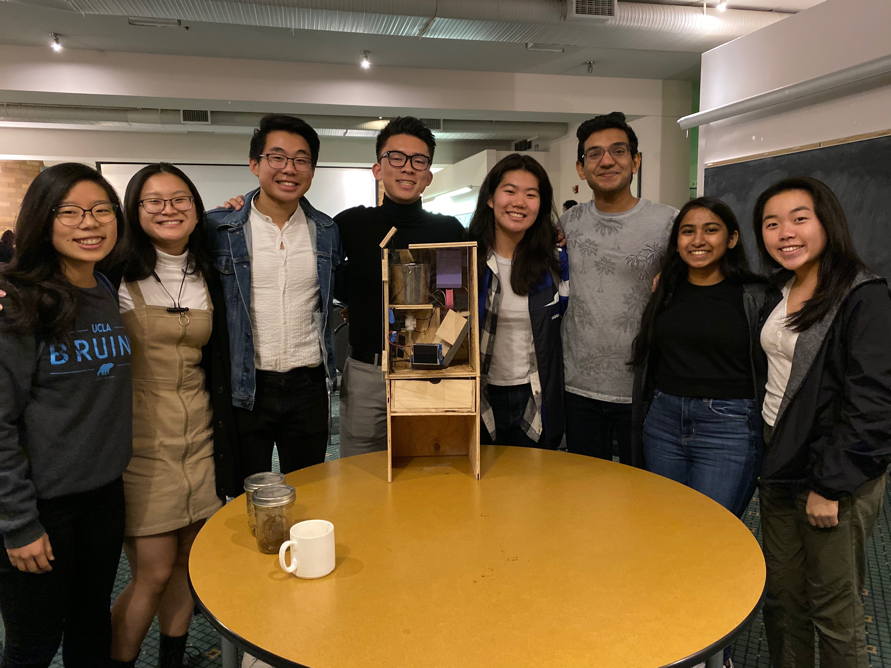
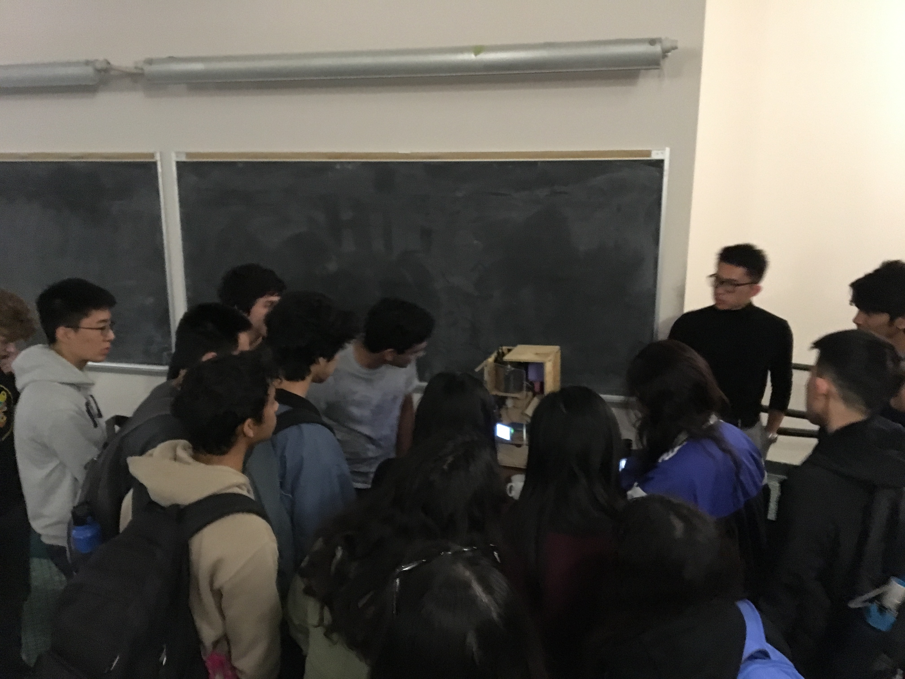
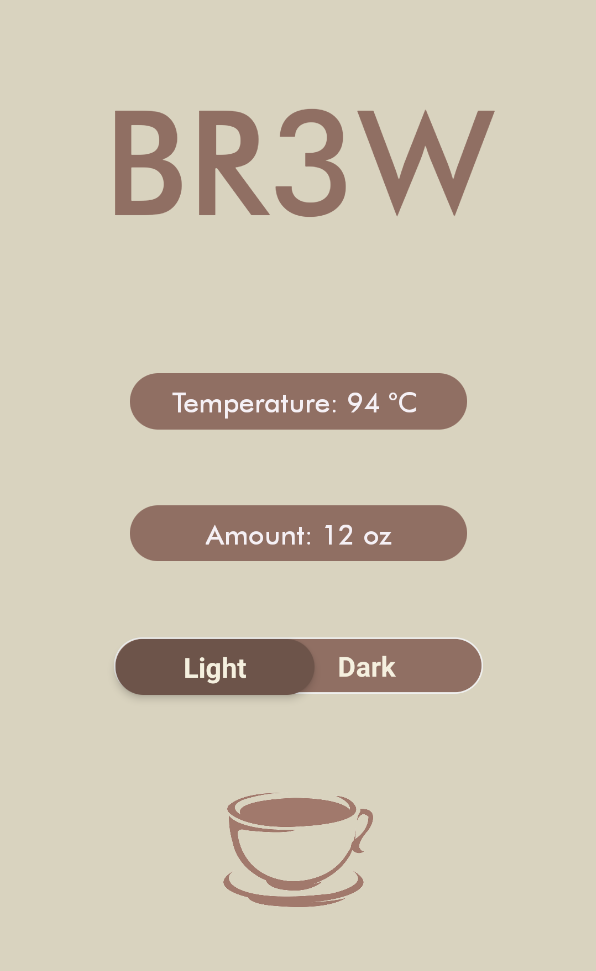
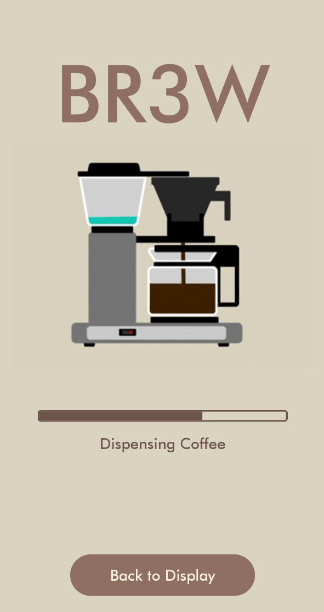

<h3>Summary</h3>

The goal of this project was to create a smart coffee maker that would be controlled by an app. Users can set preferences such as how much coffee they want and what temperature the coffee should be at from their devices. My role as a software engineer in BR3W was full stack development where I worked on both the front end development with the app as well as backend work such as sending information through Bluetooth to the Arduino.

This was my first project with app development, so at the beginning of the project, I learned to use React Native from my teammates. We chose to use React Native because it allows us to develop apps suitable for both Android devices as well as iOS devices. Additionally, a few of our teammates knew React Native already which was helpful since we only had 8 weeks to develop the project. As with learning any new language, React Native propsed some challenges. For example, with the button objects provided, we weren't able to customize the look of it and thus had to implement a custom method utilizing Touchable Opacities. Additionally, we found out the hard way that React Native is asynchronous. It may optimize some code to perform before others if it would improve the performance of the app, which makes sense but is something we didn't realize. Thus, when the state was not updating as expected, we spent a long time trying to debug this.

My favorite part of this project was just being able to learn from really amazing people! Everyone on our team brought something unique to the team, and I really felt comfortable learning from and working with them. Just from helping out some members of the build team when I had finished my tasks, I got to learn more about how our device worked on the hardware side, allowing me to program the logic of the Arduino more clearly and concisely. Plus, our team was just so passionate to learn and motivated for a common goal which made this experience an unforgettable one :)

<h3>Additional Links:</h3>
<ul>
	<li><a href="https://github.com/allisonchen23/br3w">Github Repository (forked from the original)</a></li>
</ul>

<h3>Photo Gallery</h3>

	

		

		

		

About half the team + coffee maker!

		

	

	

		

		

		

Teammates demo-ing the coffee maker to students

		

	

	

		

		

		

Home screen for our app

		

	

	

		

		

		

Screen to show coffee dispensing

		

	

