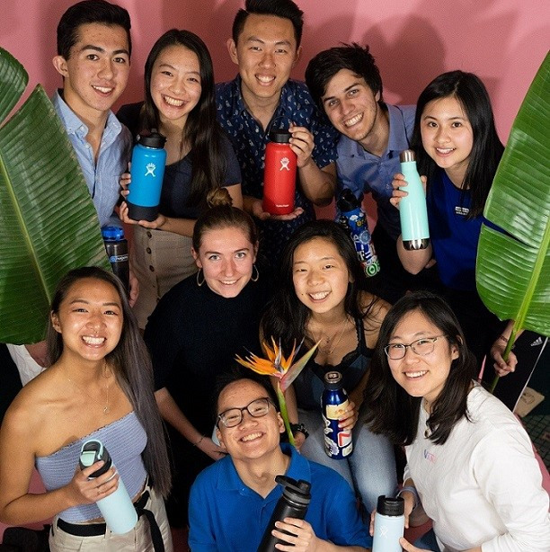

<h3>Summary</h3>

fLOW is a project I co-led with Carla Cornillon to bring awareness to water consumption in our daily lives! In the dorms this year, I have found my peers and myself actually waste a lot of water just from sinks. We tend to leave the faucet running while we soap up our hands and even brush our teeth because we are fortunate to live in a place where clean running water is so readily available. But it's important to know that a majority of people in this world don't have this luxury. fLOW consists of 2 parts to help people like you and me be more aware of how much water we use and actively cut down. The first is a sink-attachable flow rate sensor and the second is a website to display trends of data.

The flow rate sensor is currently a hall effect sensor with 3D printed sink connection adaptors. Currently, it only fits on sinks of a specific size, but we're in the process of making it a more universal fit. The sensor is connected to a time module and a ESP8266 microcontroller with wifi. Currently, when water is flowing through the sensor, the system records a timestamp and volume of water flowing and uploads this entry into the database through the ESP8266. Currently, we are using Firebase, but are looking to transition into a relational database, potentially an Oracle Database System. 

On the website, the user is able to go see the data from the sensor, including information such as daily water usage for the last week, total water usage for the week, and percent change in water usage from last week. Currently, we only have 1 sensor and 1 display to that, but we're working on implementing multiple user accounts linked to different devices. That way each user can link their own device to their account and only see data pertinent to themselves.

This project is simply a passion project from students who are motivated by finding creative ways to reduce our environmental impact! I'd personally like to thank my team for the wonderful opportunity to work with them: Carla Cornillon, Juan Banchs, Rosa Son, Andrew Li, Raeka Lin, Ray Huang, Nick Hom, Nhung Nguyen, and Sammi Owyang. Also thank you to Creative Labs at UCLA for supporting our project (both emotionally and financially)

<h3>Additional Links:</h3>
<ul>
	<li><a href="https://allisonchen.co/fLOW_frontend">Our website!</a></li>
	<li><a href="https://github.com/allisonchen23/fLOW_frontend">Github Repository for the website</a></li>
	<li><a href="https://github.com/jsbanchs/fLOW_Backend">Github Repository for Arduino Code</a></li>
	
</ul>

<h3>Photo Gallery</h3>

	

		

		

		

I love my team :)

		

	

