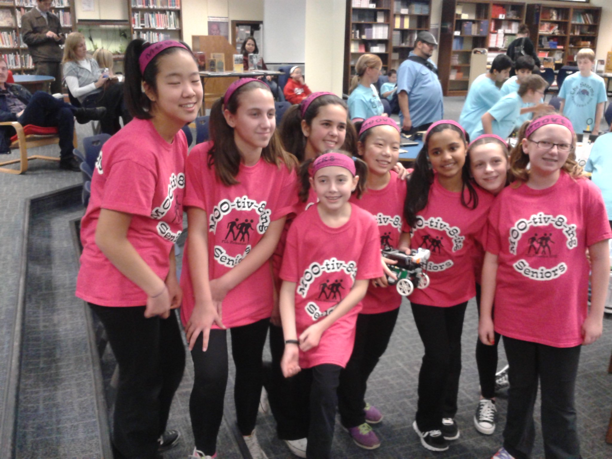

    

        

            <h2>Hey there!</h2>
            
I'm Allison Chen, and I'm originally from Chicago, Illinois. Currently, I'm a rising third year undergraduate computer science student at University of California, Los Angeles. Some of my technical interests include the applications of machine learning and AI, especially towards healthcare, the environment, and education. I strive to apply technology to serve my communities while creating a personal and socially aware impact. Apart from being a total nerd, I really enjoy the arts, especially dance and painting. I also love learning new skills and picking up hobbies, such as Spikeball, cooking, and meal prepping!
            

        

        

            
            <!-- {:class="images half main_img"} -->
        

    

  

<section id="intro">
    <h2>Inspiration</h2>
    
My love for engineering and innovation started in fifth grade when I joined an all girls FIRST Lego League team through Girl Scouts. I continued this through middle school where my team won the Illinois Championship in 2012 and 2014 and was the runner up team and nationals in 2014. Here, enjoy some embarrassing pictures of middle school me:
    

    
    
My FIRST Lego League Robotics team circa 2013

    
In high school, I continued competing in robotics first through FIRST Tech Challenge then through VEX robotics. In robotics, I was able to explore both the building/mechanical side as well as the coding/computer science side and when it was time to apply for college I reached this conclusion: I really loved both! On one hand, I enjoyed creating a design for what the robot would look like and how it would function and being able to turn that into reality. On the other, I loved actually giving the robot life through coding and innovating new ways to allow the robot to complete various tasks. Thus, I went into college with an open mind and exploring both to see which I liked better.

    
Long story short, as you know, I chose computer science. I really loved the logical thinking behind this field and applying constant principles in new and innovative ways to create faster, better, and more complex programs. As I learned more about the field, I found myself always inquiring to learn even more and it soon dawned on me that this was something I was actually interested in. Especially with how prevalent technology is in our daily lives, I truly believe that my career will be able to postively impact the most people personally through developing new software and technologies :)

</section>