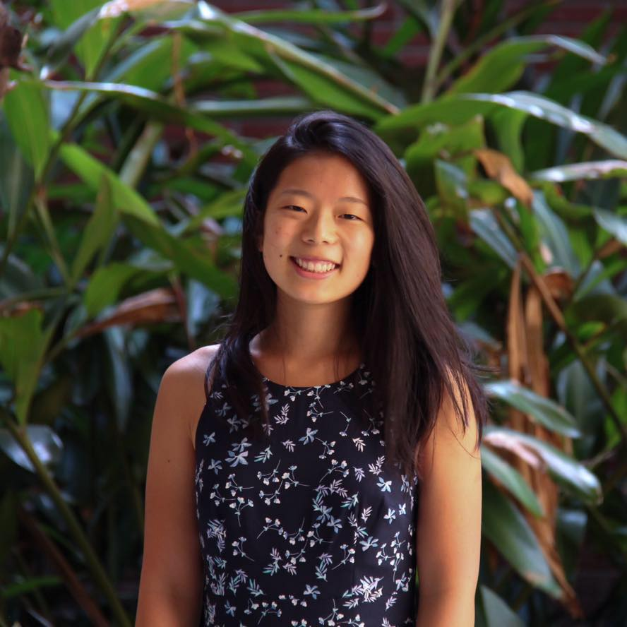

---
title:
layout: site_default
nav_category: home
---

	

		

			<h2 class="test">Allison Chen</h2>
			<h4>Computer Science PhD Student (2022-Present)</h4>
			<h4>Princeton University</h4>
			
ac4802 at princeton dot edu

			
		

		

				
		

	

	

		
I'm a first year PhD student at Princeton University studying computer science, and I'm interested in the intersection of computer vision and cognitive science. 

		
I completed my B.S. in computer science with a minor in cognitive science from UCLA in 2022. At UCLA, I was an undergraduate researcher in the <a href="http://vision.ucla.edu/">UCLA Vision Lab</a> where I worked under Dr. Stefano Soatto and with <a href="http://web.cs.ucla.edu/~alexw/">Dr. Alex Wong</a>. I was also involved with the Society of Women Engineers @ UCLA where I led the <a href="https://samueli.ucla.edu/engineering-for-humanity-research-symposium/">Engineering For Humanity Research Symposium</a> to make academic research more accessible to undergraduates.

		
I'm passionate about making academia more accessible to all students, regardless of background. If you have questions about research, navigating college, or thinking about grad school, <b>please shoot me an email</b>, I'd be more than happy to chat :) 

		
I'm a huge travel nerd and I love to learn about different cultures especially through food. I love to cook, paint, read, go on hikes and rock climbing, and play Spikeball!

	

#### News
* August 30, 2022: Started my PhD program at Princeton University!
* July 8, 2022: Our paper, [Monitored Distillation for Positive Congruent Depth Completion](https://arxiv.org/abs/2203.16034) was accepted into ECCV 2022!
* May 12, 2022: I'm very grateful to be a 2022 Intel Graduate Diversity scholar through the Society of Women Engineers.
* March 2, 2022: Our paper, [Monitored Distillation for Positive Congruent Depth Completion](https://arxiv.org/abs/2203.16034) was rejected from CVPR 2022 :)
* September 27, 2021: Alex Wong presented our work [Small Lesion Segmentation in Brain MRIs with
Subpixel Embedding](https://arxiv.org/pdf/2109.08791.pdf) at MICCAI's Brain Lesion workshop.
