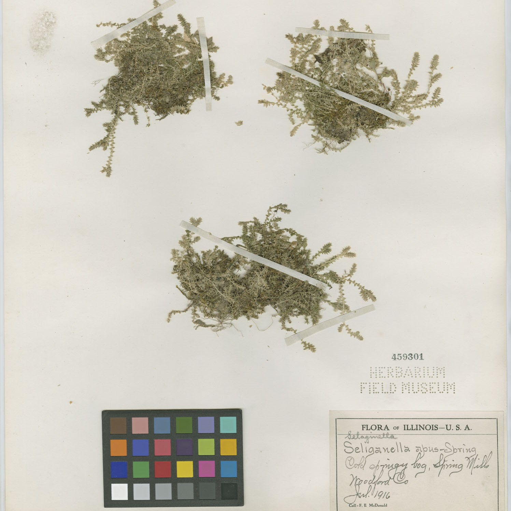
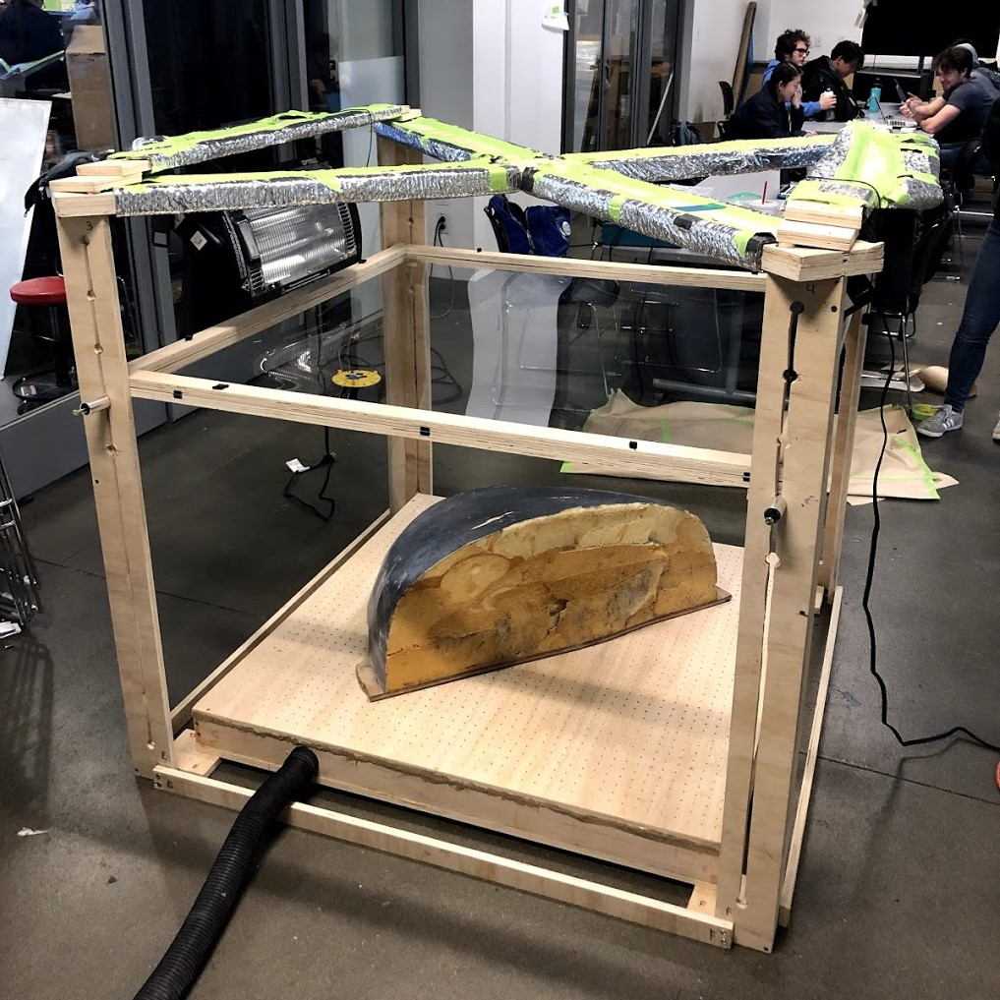

#### Selected Publications

Tian Yu Liu\*, Parth Agrawal\*, *Allison Chen\**, Byung-Woo Hong, Alex Wong. “Monitored Distillation for Positive Congruent Depth Completion”. *ECCV 2022*. \[[paper](https://arxiv.org/pdf/2203.16034.pdf)\]

Alex Wong\*, *Allison Chen\***, Yangchao Wu, Safa Cicek, Alexandre Tiard, Byung-Woo Hong, and Stefano Soatto. “Small Lesion Segmentation in MRI with Subpixel Embedding”.  *MICCAI Brain Lesion Workshop 2021*. Oral Presentation. * = equal contribution \[[code](https://github.com/alexklwong/subpixel-embedding-segmentation)\] \[[paper](https://arxiv.org/pdf/2109.08791.pdf)\]

#### Earlier projects (2019-2020)

    <a href="experiences/fLOW_entry.html">
        

            
            

                

                    
fLOW: Water Usage Awareness

                

                

                    

                        
<i class="fa fa-map-marker" aria-hidden="true"></i>

                        

UCLA

                    

                    

                        
<i class="fa fa-calendar" aria-hidden="true"></i>

                        

Jan 2020 - Sep 2020

                    

                

            

        

    </a>
    <a href="experiences/br3w_entry.html">
        

            
            

                

                    
BR3W: A Smart Coffee Machine

                

                

                    

                        
<i class="fa fa-map-marker" aria-hidden="true"></i>

                        

UCLA

                    

                    

                        
<i class="fa fa-calendar" aria-hidden="true"></i>

                        

Oct 2019-Dec 2019

                    

                

            

        

    </a>
    <a href="experiences/fm_entry.html">
        

            
            

                

                    
Machine Learning at the Field Museum

                

                

                    

                        
<i class="fa fa-map-marker" aria-hidden="true"></i>

                        

Chicago, Illinois

                    

                    

                        
<i class="fa fa-calendar" aria-hidden="true"></i>

                        

June 2019-Aug 2019

                    

                

            

        

    </a>
    <a href="experiences/thermoforming_entry.html">
        

            
            

                

                    
Thermoforming Rig (A MechE Project)

                

                

                    

                        
<i class="fa fa-map-marker" aria-hidden="true"></i>

                        

UCLA

                    

                    

                        
<i class="fa fa-calendar" aria-hidden="true"></i>

                        

Oct 2018-Feb 2019

                    

                

            

        

    </a>

